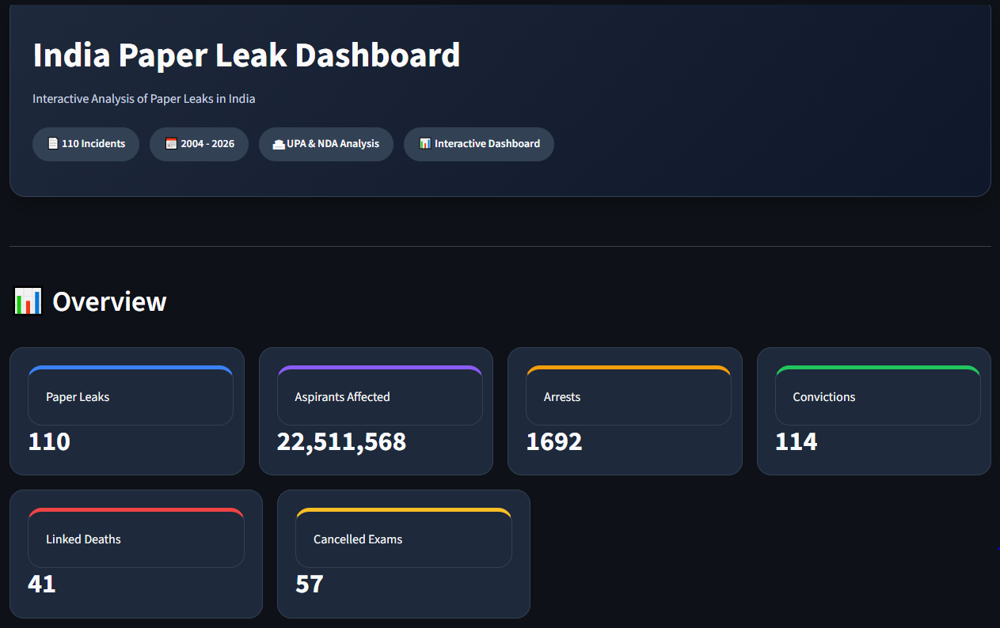
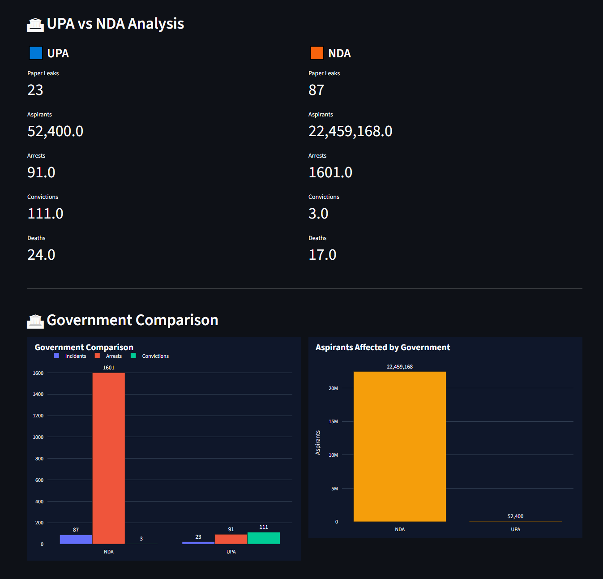
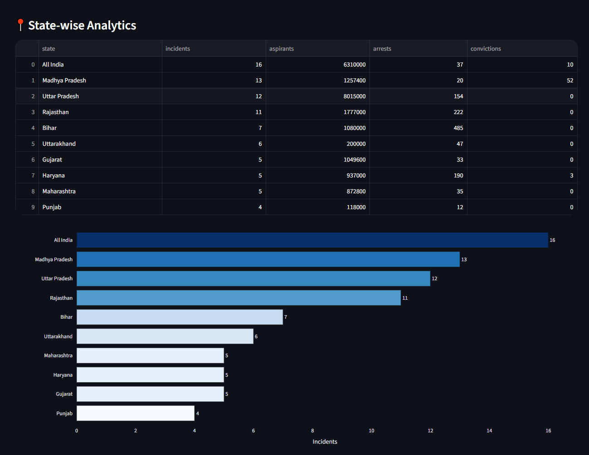
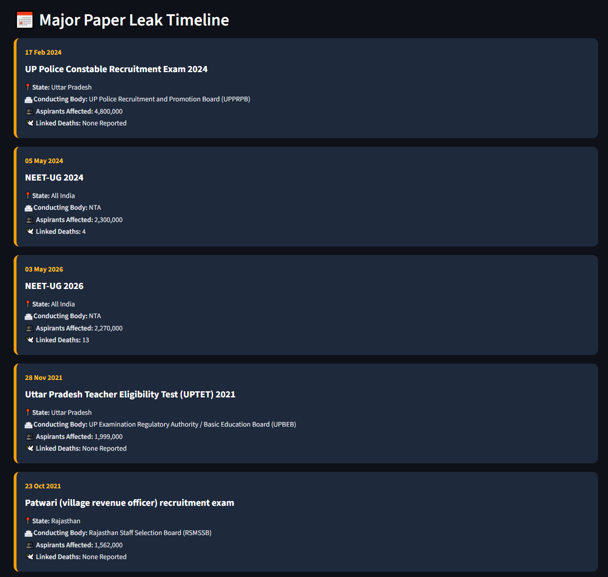
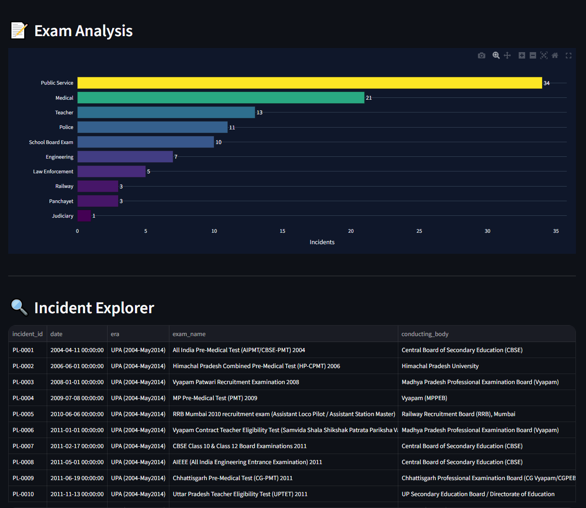

# India Paper Leak Dashboard (2004–2026)

<div align="center">


### **An interactive analytics dashboard exploring paper leak incidents across India (2004–2026)**

**Transforming publicly reported paper leak data into meaningful insights through interactive visualizations, timelines, and analytics.**

🌐 **Live Demo:** *https://india-paper-leak-dashboard.streamlit.app/*

</div>

---

# 📖 Overview

Paper leak incidents have affected millions of students across India over the past two decades. This dashboard provides a comprehensive data-driven analysis of these incidents, helping users understand long-term trends, geographical distribution, affected examinations, conducting bodies, and the overall impact on aspirants.

The dashboard is designed to provide policymakers, researchers, journalists, students, and the general public with an easy-to-understand visual representation of publicly reported paper leak incidents.


---

# 📂 Data Source

This dashboard is built using the **"India Paper Leaks from 2004 to 2026"** dataset created by **Sujay Nadkarni** and published on Kaggle. The dataset compiles publicly reported paper leak incidents across India and includes details such as examination name, date, state, conducting body, aspirants affected, arrests, convictions, linked deaths, and source references. :contentReference[oaicite:0]{index=0}

### Attribution

- **Dataset:** *India Paper Leaks from 2004 to 2026*
- **Dataset Link:** *https://www.kaggle.com/datasets/sujaynadkarni/india-paper-leaks-from-2004-to-2026*
- **Author:** Sujay Nadkarni
- **Platform:** Kaggle

This repository presents an **independent analysis and visualization** of the dataset and is **not affiliated with, endorsed by, or maintained by the original dataset author**.

For reproducibility and transparency, a copy of the original CSV dataset is included in the `data/` directory of this repository, with full credit to the original creator.

Please refer to the original Kaggle dataset for updates, corrections, and additional information.

# ✨ Features

## 📊 Executive Dashboard

- Overall paper leak statistics
- Aspirants affected
- Total arrests
- Total convictions
- Linked deaths
- Year-wise overview

---

## 📈 Interactive Visualizations

- Year-wise paper leak trend
- Government-wise comparison (UPA vs NDA)
- State-wise analytics
- Conducting body analysis
- Distribution charts
- Responsive Plotly visualizations

---

## 🏛 Conducting Body Analytics

Discover which organizations have experienced the highest number of reported paper leak incidents.

Includes:

- Top conducting body categories
- Incident counts
- Aspirants affected
- Arrests
- Convictions

---

## 📍 State-wise Analytics

Analyze paper leak incidents across Indian states.

Features:

- Top affected states
- Interactive charts
- Key insights
- Comparative statistics

---

## 📅 Major Incident Timeline

Explore the **Top 10 major paper leak incidents** with details including:

- Date
- Examination
- State
- Conducting body
- Aspirants affected
- Linked deaths

---

## 💡 Automated Insights

The dashboard automatically generates insights such as:

- Highest affected state
- Top conducting bodies
- States affecting the largest number of aspirants
- Arrest and conviction statistics

---

## 📌 Quick Facts

Instantly view important statistics including:

- Total incidents
- Number of affected states
- Conducting bodies involved
- Total aspirants affected
- Arrests
- Convictions
- Linked deaths

---

## 🔍 Incident Explorer

An interactive data explorer allowing users to:

- Search incidents
- Sort records
- Filter data
- Explore complete incident details

---

# 📊 Dashboard Sections

- Executive Summary
- KPI Cards
- Government Comparison
- Year-wise Trends
- Conducting Body Analytics
- State-wise Analytics
- Key Insights
- Major Incident Timeline
- Quick Facts
- Incident Explorer

---

# 🛠 Tech Stack

| Technology | Purpose |
|------------|---------|
| Python | Programming Language |
| Streamlit | Dashboard Framework |
| Pandas | Data Processing |
| Plotly | Interactive Charts |
| NumPy | Numerical Computation |

---

# 📂 Project Structure

```
India-Paper-Leak-Dashboard/
│
├── app.py
├── config.py
├── requirements.txt
├── README.md
│
├── assets/
│
├── data/
│   └── paper_leaks.csv
│
└── utils/
    ├── calculations.py
    ├── charts.py
    ├── data_loader.py
    ├── filters.py
    └── helpers.py
```

---

# 🚀 Installation

Clone the repository

```bash
git clone https://github.com/<your-username>/india-paper-leak-dashboard.git
```

Navigate to the project

```bash
cd india-paper-leak-dashboard
```

Install dependencies

```bash
pip install -r requirements.txt
```

Run the dashboard

```bash
streamlit run app.py
```

---

# 📱 Screenshots

## Dashboard Overview


<p align="center">

</p>

---

## Government Comparison

> Comparison of paper leak incidents, aspirants affected, arrests, convictions, and linked deaths across different government periods.

<p align="center">

</p>

---

## State-wise Analytics

>

<p align="center">

</p>

---

## Major Incident Timeline


<p align="center">

</p>

---

## Incident Explorer

<p align="center">

</p>

---

# 📈 Dataset Information

The dashboard contains publicly reported paper leak incidents between **2004 and 2026**.

Each record includes information such as:

- Examination Name
- Date
- State
- Conducting Body
- Examination Category
- Body Type
- Aspirants Affected
- Arrests
- Convictions
- Linked Deaths
- Source Information
- Confidence Level

---

# 🎯 Use Cases

This dashboard can be useful for:

- Researchers
- Journalists
- Students
- Policy Makers
- Data Analysts
- Education Sector
- Competitive Exam Aspirants

---

# 🌟 Highlights

- Interactive Dashboard
- Mobile Responsive
- Modern Dark Theme
- Interactive Charts
- Automated Insights
- Timeline Visualization
- Data Explorer
- Lightweight
- Easy to Deploy
- Open Source

---

# 📊 Future Enhancements

Planned improvements include:

- Interactive India Map
- Advanced Search
- Download Reports (PDF/CSV)
- Trend Forecasting
- Machine Learning Insights
- Category-wise Comparison
- State Rankings
- Public API Integration
- Real-time Data Updates

---

# 🤝 Contributing

Contributions are welcome!

If you'd like to improve the dashboard:

1. Fork the repository
2. Create a new feature branch
3. Commit your changes
4. Push to your fork
5. Open a Pull Request

---

# ⚠ Disclaimer

This dashboard is intended solely for educational, analytical, and research purposes.

The information presented is compiled from publicly available reports and news sources. While efforts have been made to ensure accuracy, users should independently verify facts before relying on them for official or legal purposes.

---

# 📄 License

This project is licensed under the **MIT License**.

---

# 👨‍💻 Author

**Arghya Das**

Python Developer | AI Engineer | Data Analytics Enthusiast

GitHub: https://github.com/Arghya-das99/

LinkedIn: https://www.linkedin.com/in/arghya-das-60a118193

---

# 🙏 Acknowledgements

Special thanks to **Sujay Nadkarni** for compiling and publishing the **India Paper Leaks from 2004 to 2026** dataset, which made this analysis possible. The effort involved in collecting, verifying, and organizing publicly available information into a structured dataset is sincerely appreciated.

---

<div align="center">

### ⭐ If you found this project useful, consider giving it a Star!

**Made with ❤️ using Streamlit, Python, Pandas & Plotly**

---


</div>
